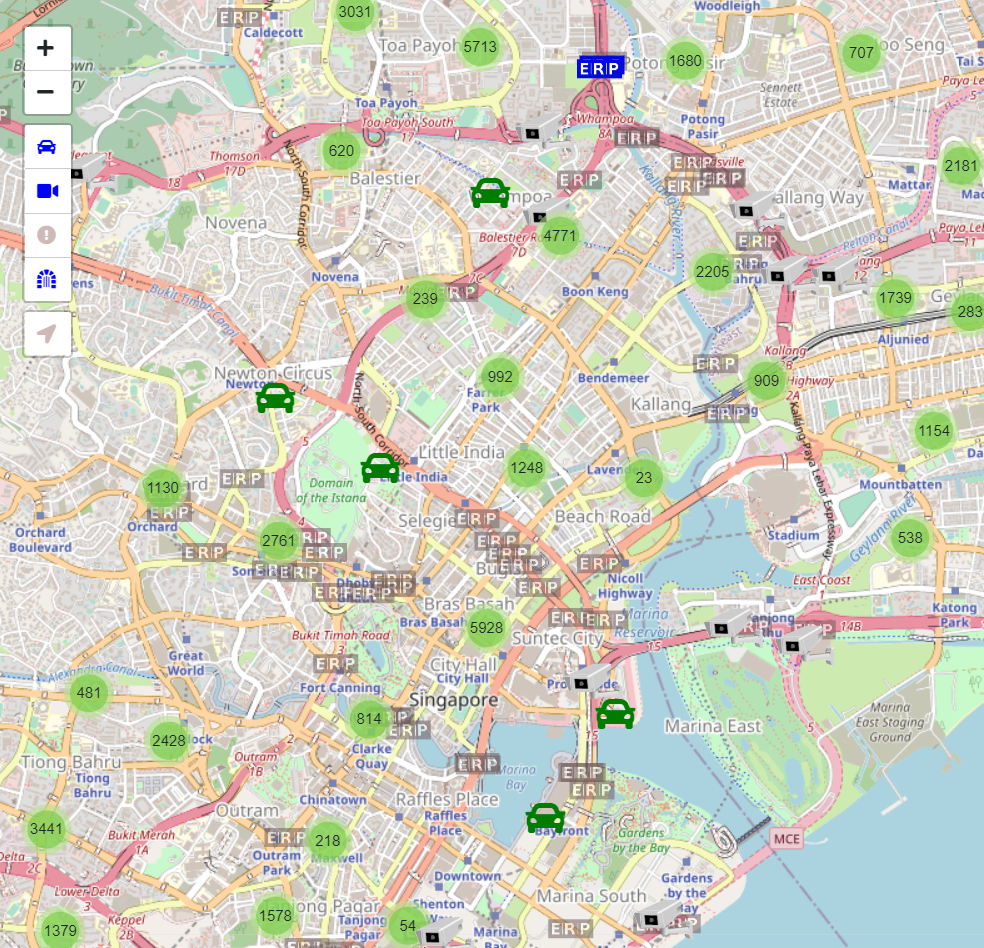

# CarHub

This repository contains the project work done by:
- [Jaryl](https://github.com/JarylCJL)
- [Lin Xiang](https://github.com/lxcel)
- [Justin](https://github.com/JustinOng)
- [Joel](https://github.com/Jnse97)
- [Wei Hong](https://github.com/CanonAAA)

CarHub is a visualisation for various traffic related information available from government APIs:
- Car park lot availability
- Traffic Images
- ERP Gantry Information
- Traffic Incidents

